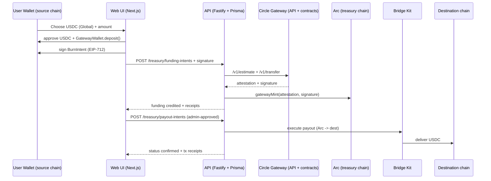

# Arc — Global Payouts + Treasury with USDC (Circle Gateway + Wallets + Bridge Kit)

## What we built
We extended `gh-bounties` with a **chain-abstracted USDC treasury on Arc** that supports:

- **Global USDC funding** from multiple chains using **Circle Gateway** (user deposits USDC on their source chain; backend mints to Arc treasury).
- **Treasury ledger** per bounty (available / funded / paid).
- **Automated payouts** (agent/worker-driven) using **Bridge Kit**, optionally executed via **Circle Wallets**.

No swaps. Only USDC flows.

---

## Why this matters
Open-source bounties are global, but payouts are fragmented:
- funders have USDC on many chains
- contributors want USDC on their preferred chain
- maintainers need a treasury with controls + auditability

This feature turns “approve payout” into a reliable, end-to-end global USDC delivery flow with receipts.

---

## Circle tools used (required)

- **Arc**: treasury destination chain (USDC minted to the Arc treasury address) and the source of outbound payouts.
- **Circle Gateway**: chain-abstracted inbound USDC funding (deposit on source chain → attest → mint on Arc).
- **Bridge Kit**: outbound USDC payouts from Arc to a chosen destination chain/address.
- **Circle Wallets**: optional adapter for Bridge Kit execution (set env vars to run payouts via Circle Wallets instead of a raw private key).

---

## Product experience (MVP)

### Funding (global USDC)
1. User clicks “Add funds” on an issue.
2. Selects **USDC (Global via Gateway)** + a supported source chain.
3. The UI:
   - approves USDC
   - calls `GatewayWallet.deposit(token, amount)` on the source chain
   - signs a **BurnIntent (EIP-712)**
   - sends the signature to the backend
4. Backend calls the **Circle Gateway API** to get attestation, then mints USDC to the Arc treasury.
5. Treasury ledger credits the bounty.

### Payouts (agent-driven)
1. Repo admin opens the issue row → “Treasury”.
2. Creates a payout intent (recipient, chain, amount).
3. The **orchestrator** picks it up and executes the payout via **Bridge Kit**, updating status + receipts.

---

## Architecture diagram

---

## Implementation notes (what to review)

- Spec: `specs.doc:1`
- API routes: `apps/api/src/treasury/routes.ts:1`
- Orchestrator (agent-driven): `apps/api/src/treasury/orchestrator.ts:1`
- Web funding flow: `apps/web/src/components/fund-issue-dialog.tsx:1`
- Treasury UI: `apps/web/src/components/treasury-dialog.tsx:1`

---

## How to run (local)

1. Install deps: `pnpm install`
2. Set env (root `.env`):
   - `DATABASE_URL_FEAT_ARC=file:./prisma/dev-feat-arc.db` (keeps main DB clean)
   - `TREASURY_ENABLED=1`
   - `CIRCLE_GATEWAY_API_URL=https://gateway-api-testnet.circle.com`
   - `TREASURY_ARC_CHAIN_ID=5042002`
   - `TREASURY_ARC_RPC_URL=https://rpc.testnet.arc.network`
   - `TREASURY_DESTINATION_CALLER_PRIVATE_KEY=0x...` (needs Arc gas)
   - `TREASURY_ADDRESS=0x...` (must match the private key’s address; MVP constraint)
   - Optional Bridge Kit via Circle Wallets:
     - `CIRCLE_API_KEY=...`
     - `CIRCLE_ENTITY_SECRET=...`
3. Run:
   - `pnpm --filter @gh-bounties/api dev`
   - `pnpm --filter @gh-bounties/web dev`

---

## Demo script (2–3 minutes)
1. Show an issue row in the UI.
2. “Add funds” → “USDC (Global via Gateway)” → pick a source chain → fund.
3. Show the treasury dialog:
   - “Available USDC” increases
   - funding intent shows `credited` with an Arc mint tx hash
4. Create a payout intent (recipient + destination chain).
5. Wait for the orchestrator to mark it `confirmed` and show tx hashes.

---

## Product feedback (actionable)

- Gateway flow is powerful, but the happy-path UX needs guardrails:
  - better surfaced error taxonomy for common user mistakes (wrong chain, no USDC, allowance/approval issues)
  - “estimate → transfer → mint” should have explicit idempotency guidance per step
- Bridge Kit integration would benefit from:
  - a canonical mapping of chain identifiers + testnet coverage examples
  - a structured “receipt object” schema (source tx, bridge tx, destination tx) for UI timelines
- Circle Wallets developer ergonomics:
  - clearer “adapter” quickstart showing the minimal env + permissions needed for a single payout

---

## Next steps (post-hackathon)
- Move `gatewayMint` signing from raw EOA to **Circle Wallets** custody (remove the MVP “address must match private key” constraint).
- Add payout policies (auto-pay under a threshold; batching; rate limits).
- Add a treasury rebalancer to maintain target USDC balances across chains.

